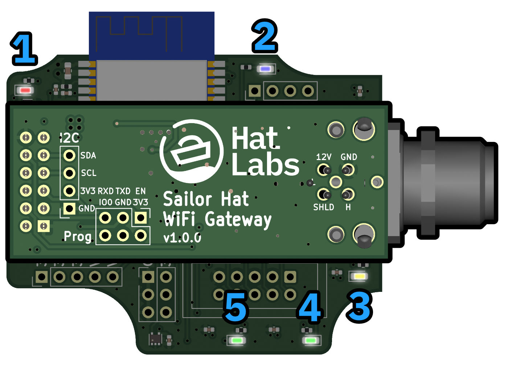
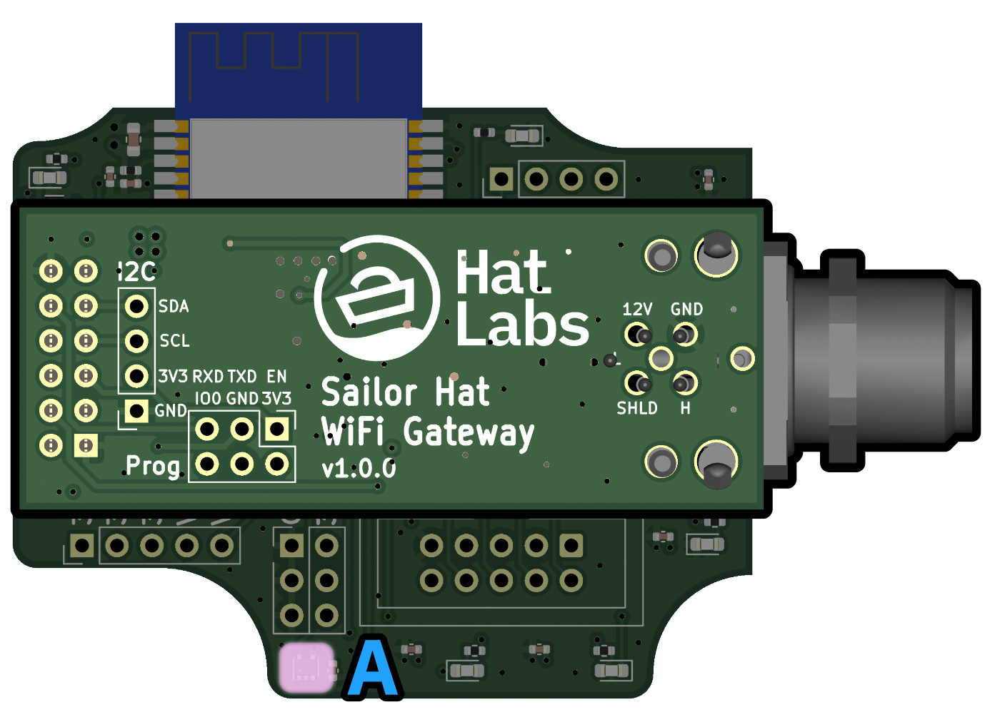
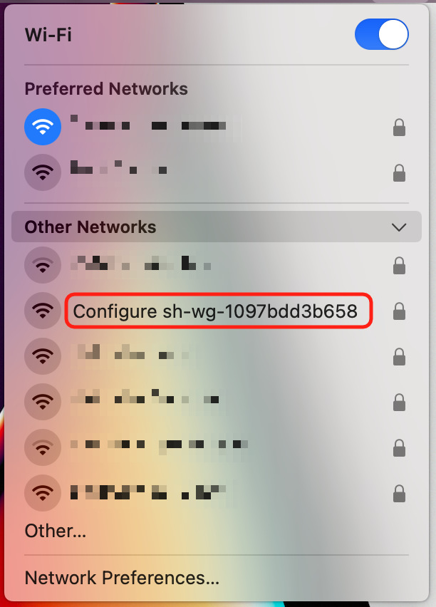
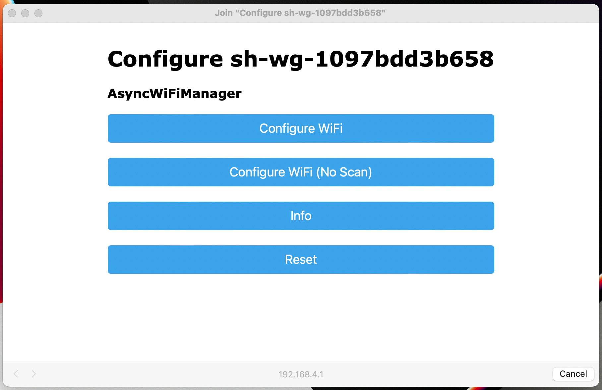
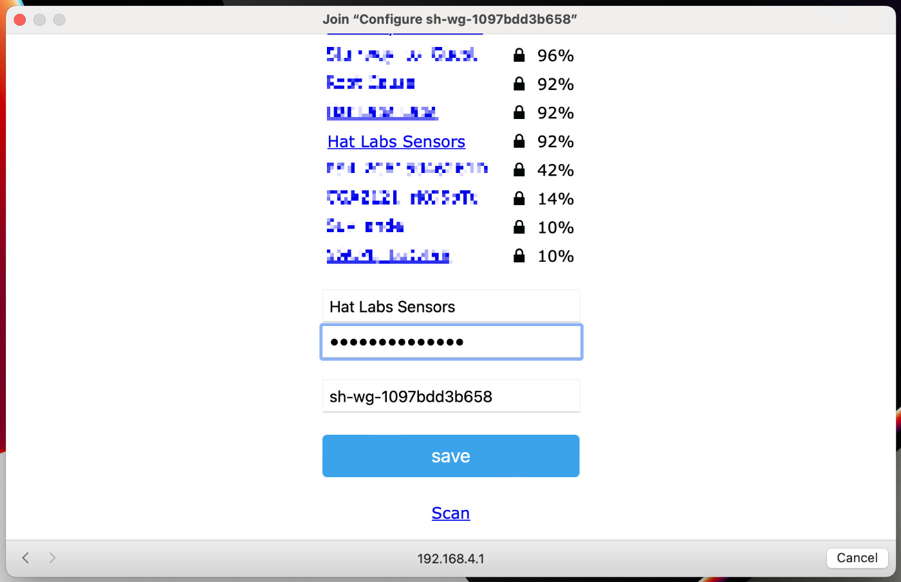

# Sailor Hat WiFi Gateway (SH-wg) Firmware

## Introduction

This repository provides firmware for the [Sailor Hat WiFi Gateway](https://github.com/hatlabs/SH-wg-hardware).
SH-wg implements an NMEA 2000 WiFi gateway that broadcasts NMEA 2000 sentences over WiFi.
To perform its function, the device needs to be connected to an NMEA 2000 bus and to a WiFi access point.

## Installation

This project uses [PlatformIO](https://platformio.org/) for building and uploading the firmware.
No on-board USB interface is provided; to connect a computer to the SH-wg, you must use a USB-to-serial adapter.
[ESP-Prog](https://docs.espressif.com/projects/espressif-esp-iot-solution/en/latest/hw-reference/ESP-Prog_guide.html) is known to work and easily available.

If you are using ESP-Prog, note that it exposes two serial ports.
The first port is for the JTAG interface and the second one for programming and serial communication.
Depending on your operating system, you may have to configure the serial port on `platformio.ini` lines 46 and 47.

Connect the ESP-Prog to the SH-wg, either by using the exposed 2x3 pin header on the mezzanine board, or by connecting the programmer to the board interconnect pin header.
Then, select "Upload and Monitor" from the PlatformIO "bug" menu.
This will build and upload the firmware and start the serial monitor.

## Description of LEDs

The SH-wg device includes a number of LEDs that indicate the status of the device.

{:width="50%"}

1. Red: Power LED.
   On when the device is powered.
   Turns off when magnet presence is detected (see the next section).
   Blinks rapidly during an over-the-air update.
2. Blue: WiFi LED.
   On when WiFi is connected.
   Blinks when the configuration portal is activated.
3. Yellow: Normally on.
   Blips when data is broadcast over UDP.
4. Green: TX: Blinks when data is transmitted over the NMEA 2000 bus.
5. Green: RX: Blinks when data is received over the NMEA 2000 bus.

## Magnet "Button" User Interface

SH-wg is enclosed in a waterproof enclosure.
Basic interaction such as restarting and resetting the device is nevertheless possible using a magnet.
Slide the provided neodymium magnet against the enclosure next to the magnet sensor shown in the picture below.

{:width="50%"}

When the magnet is detected, the red LED turns off.

The sensor reacts to two different events:

- One second "button press": restart the device.
- Ten second long "button press": reset the device to factory defaults.
  This can be used to re-enable the configuration portal if the device no longer connects to the WiFi.

## Initial Configuration

An unconfigured SH-wg will create its own WiFi access point (a so-called "configuration portal).
The user can connect to that access point and define the WiFi configuration.

When the configuration portal is activated, the blue LED is blinking.
The device is visible on the computer's WiFi network listing:

{:width="50%"}

The network name is "Configure sh-wg-xxxxxxxxxxxx", the last 12 digits corresponding to the device unique identifier.
You also need to provide a password to connect to the configuration portal. The password is "thisisfine".

Once you have successfully connected to the configuration portal, you should be automatically presented with the WiFi configuration front page:

{:width="70%"}

Click the "Configure WiFi" button.
You'll get a list of nearby WiFi networks.

{:width="70%"}

One of them should be the boat network you want to connect to.
Select that and enter the network password.
Press "save".

If the SH-wg is able to connect to the configured network, it will restart itself and the blue LED will stop blinking and turn on.
If the configuration failed, the blue LED will keep blinking and you must repeat the operation.

## OTA Updates

SH-wg will periodically check an online server for updates.
If an update is available, it will be automatically downloaded and installed.
Once the update is finished, the device will resume operating with the old firmware.
Only once the device is restarted will it switch to the new firmware version.
